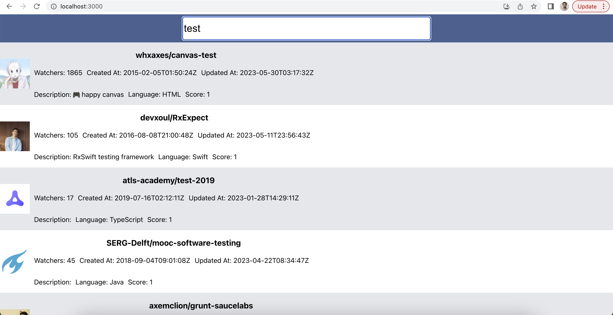

### GitHub Repo search implementaion.
- Steps to run repo
    1. Navigate to rep-search
    2. Install node-modules with the help of ```npm i```
    3. Go to your github and generate a token.
        - settings.
        - Developer settings.
        - Personal access tokens. 
        - token classic.
        - hit on generate token.
    4. Navigate to ```rep-search/src/App.js``` and replace the variable named **githubToken** with your token
- Working repo screenshot

